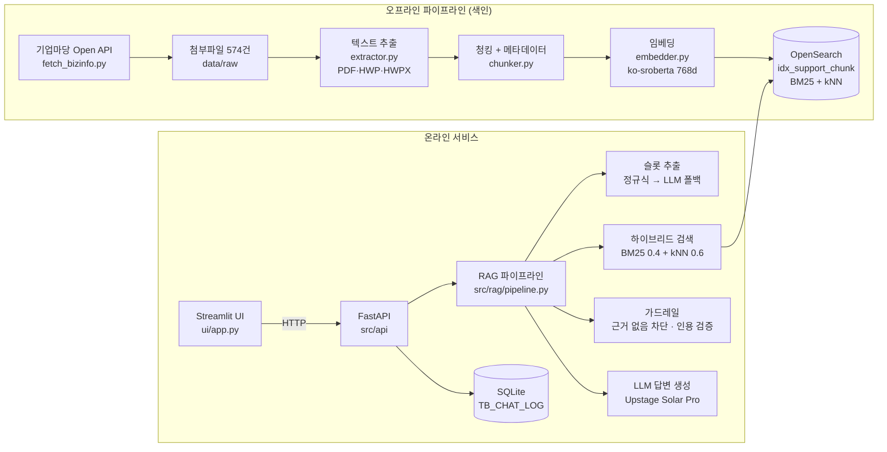

# LocalGovSupportRAG

**지자체·중앙부처 지원사업 공고를 근거로 답하는 RAG 챗봇.**
사용자가 "소상공인인데 온라인 쇼핑몰 입점 지원 있어?"처럼 자기 말로 물으면, 기업마당 공고 491건에서 관련 공고를 찾아
**어느 공고에 근거했는지 `[번호]`로 인용한 답변**과 공고 카드를 돌려줍니다. 근거가 없으면 지어내지 않고 "찾지 못했습니다"라고 답합니다.

- 1차 서비스 범위: 서울특별시(기업마당 해시태그 기준) / 개발 기간 2026-08-19 ~ 2026-09-22 (WBS 1~8)
- 평가 결과: **Hit@5 88.9% · MRR 0.713** (공고 제목과 다른 표현으로 물은 질의 기준, 목표 80% · 0.6) → [평가 리포트](docs/evaluation_report.md)

---

## 1. 아키텍처



**질문 1개가 처리되는 순서** (`src/rag/pipeline.py`의 `answer_question()`)

1. **슬롯 추출**: 질문에서 지역·분야(필터로 사용)와 지원대상(검색어 힌트로 사용)을 뽑습니다. 먼저 정규식으로 시도하고, 아무것도 못 찾으면 LLM에 맡깁니다.
2. **하이브리드 검색**: BM25와 kNN을 따로 20개씩 검색합니다. 두 점수는 스케일이 달라서 min-max 정규화를 한 뒤 0.4 : 0.6으로 더하고, 사업당 최대 2청크로 top-5를 고릅니다.
3. **가드레일(호출 전)**: top-5의 최고 kNN 점수가 0.77 미만이면 LLM을 부르지 않고 "찾지 못했습니다"라고 답합니다.
4. **컨텍스트 조립 → LLM 답변**: 근거마다 `[1]~[5]` 번호를 붙이고, 모든 사실 문장에 번호를 인용하도록 강제하는 프롬프트로 답을 생성합니다.
5. **가드레일(호출 후)**: 없는 번호를 인용하면 그 번호를 지우고, 인용이 하나도 없으면 답변을 버립니다.

응답의 `status`는 `ok`, `no_evidence`, `ungrounded`, `llm_unavailable`, `llm_error` 중 하나라서 화면과 평가가 결과를 구분할 수 있습니다.

### 설계에서 내린 주요 결정

| 결정 | 이유 |
|---|---|
| 관계형 DB 없이 OpenSearch 인덱스 하나로 운영 | 청크마다 사업 메타데이터를 같이 저장(비정규화)해서 검색·필터·표시를 한 번에 처리. 대화 로그만 SQLite |
| 임베딩은 로컬 ko-sroberta, LLM은 Upstage Solar Pro | 무과금 운영 방침(분석모델 정의서 2.4). 한국어 특화 |
| 하이브리드 가중치 0.4 : 0.6 | 정의서 권장값. 평가에서 0.2~0.8 중 MRR 최고(0.927) |
| 정규식 우선, LLM은 폴백으로만 슬롯 추출 | 대부분의 질문은 "창업", "수출"처럼 후보값을 그대로 포함하므로 LLM 비용·지연을 아낌 |
| 인용 번호 `[n]`을 강제하고 코드로 검증 | 프롬프트 지시만으로는 모델이 규칙을 어길 수 있어서, 정규식으로 인용을 대조 |
| 파일 확장자가 아니라 파일 앞부분 바이트로 형식 판별 | `.pdf`/`.hwpx`로 저장됐지만 실제로는 HWP인 파일이 실데이터에 섞여 있었음 |

---

## 2. 기술 스택

| 영역 | 사용 기술 |
|---|---|
| 언어 | Python 3.12 |
| 데이터 수집 | 기업마당(bizinfo.go.kr) Open API (RSS/XML) |
| 전처리 | pdfplumber, olefile(HWP), zipfile+XML(HWPX) |
| 검색 | OpenSearch 3.8 (faiss HNSW, cosine), opensearch-py |
| 임베딩 | `jhgan/ko-sroberta-multitask` (sentence-transformers, 768차원, 로컬) |
| LLM | Upstage Solar Pro (`solar-pro2`, OpenAI 호환 API), temperature 0.2 |
| 백엔드 | FastAPI, Pydantic, uvicorn, SQLite |
| 화면 | Streamlit |
| 테스트 | FastAPI TestClient, Streamlit AppTest (실행 스크립트 방식, pytest 미사용) |

버전은 [`requirements.txt`](requirements.txt)에 고정했습니다.

---

## 3. 폴더 구조

```
LocalGovSupportRAG/
├── src/
│   ├── crawler/fetch_bizinfo.py      # [WBS 2] 기업마당 API 수집 -> data/raw + metadata.csv
│   ├── preprocessing/
│   │   ├── extractor.py              # [WBS 3] PDF/HWP/HWPX 텍스트·표 추출 -> extracted.json
│   │   └── chunker.py                # [WBS 3] 문장 경계 청킹(오버랩) + 접수기간/금액 추출 -> chunks.json
│   ├── indexing/                     # [WBS 4]
│   │   ├── config.py                 #   인덱스 이름·임베딩 모델·접속 설정 (공통)
│   │   ├── index_mapping.py          #   매핑(keyword/date/knn_vector) 정의 및 인덱스 생성
│   │   ├── embedder.py               #   청크 임베딩 -> chunks_embedded.json (이어하기 지원)
│   │   ├── bulk_indexer.py           #   Bulk API 색인 (_id = chunk_id, 재실행해도 중복 없음)
│   │   └── verify_index.py           #   색인 검증 (문서 수, 매핑, BM25/kNN 동작)
│   ├── rag/                          # [WBS 5] query_slots, hybrid_search, context_builder,
│   │                                 #   prompt_template, generator, guardrail, llm_client, pipeline
│   ├── api/                          # [WBS 6] FastAPI: main, schemas, dependencies, chat_log,
│   │   └── routers/                  #   program_service / routers(chat, programs)
│   └── evaluation/                   # [WBS 7] metrics, retrieval_eval, answer_eval
├── ui/                               # [WBS 6] Streamlit: app.py, api_client.py
├── tests/                            # [WBS 6~8] run_all.py + 테스트 8종
├── data/
│   ├── raw/, processed/              # 수집·가공 산출물 (git 제외)
│   └── eval/eval_queries.json        # [WBS 7] 평가 질의셋 + 정답 라벨
└── docs/
    ├── evaluation_report.md          # [WBS 7] 평가 리포트
    └── eval/                         # 평가 결과 원자료(JSON)
```

---

## 4. 실행 방법 (Windows 기준)

### 4.1 준비
1. **Python 가상환경**
   ```
   python -m venv .venv
   .venv\Scripts\python.exe -m pip install -r requirements.txt
   ```
2. **OpenSearch 3.8** - zip으로 설치하고 `config/opensearch.yml`에 `plugins.security.disabled: true`를 넣은 뒤
   `bin\opensearch.bat`로 실행합니다. 로컬 개발용이라 HTTP·무인증이고, `localhost:9200`에서 준비되기까지 약 30초 걸립니다.
3. **`.env`** (프로젝트 루트, git 제외)

   | 변수 | 용도 | 필수 |
   |---|---|---|
   | `BIZINFO_API_KEY` | 기업마당 Open API 인증키 (수집 단계) | 수집 시 |
   | `UPSTAGE_API_KEY` | LLM 답변 생성 ([console.upstage.ai](https://console.upstage.ai/api-keys)) | 없으면 공고 목록만 안내 |
   | `LLM_PROVIDER` / `LLM_MODEL` | `upstage`(기본) 또는 `openai` / 모델명 덮어쓰기 | 선택 |
   | `OPENSEARCH_HOST` / `OPENSEARCH_PORT` | 기본 `localhost` / `9200` | 선택 |
   | `CHAT_LOG_DB_PATH` | 대화 이력 DB 경로 (기본 `data/chat_log.db`) | 선택 |

### 4.2 색인 파이프라인 (처음 한 번, 순서대로)
```
.venv\Scripts\python.exe src\crawler\fetch_bizinfo.py      # 수집 (API 키 필요)
.venv\Scripts\python.exe src\preprocessing\extractor.py    # 추출 (약 10분 이상 - 느려도 멈춘 게 아님)
.venv\Scripts\python.exe src\preprocessing\chunker.py      # 청킹
.venv\Scripts\python.exe src\indexing\index_mapping.py     # 인덱스 생성 (이미 있으면 건너뜀)
.venv\Scripts\python.exe src\indexing\embedder.py          # 임베딩 (첫 실행 시 모델 다운로드)
.venv\Scripts\python.exe src\indexing\bulk_indexer.py      # 색인
.venv\Scripts\python.exe src\indexing\verify_index.py      # 검증
```

### 4.3 서비스 실행
```
.venv\Scripts\python.exe -m uvicorn src.api.main:app --port 8000    # 백엔드 (준비까지 약 20초)
.venv\Scripts\python.exe -m streamlit run ui/app.py                 # 화면 -> http://localhost:8501
```
- API 문서: http://127.0.0.1:8000/docs (Swagger UI)
- API 주소는 `localhost` 말고 **`127.0.0.1`**로 부르세요. Windows에서 `localhost`는 IPv6를 먼저 시도해서 요청마다 약 2초가 더 걸립니다(실측 14~30ms vs 약 2,060ms).

| 엔드포인트 | 설명 |
|---|---|
| `POST /chat` | 질문 → 인용 답변 + 근거 카드 + 적용된 검색 조건 + 응답 시간 |
| `GET /chat/history/{session_id}` | 대화 이력 재조회 |
| `GET /programs` | 지원사업 목록 (지역/분야 필터, 사업명 부분 검색, 페이지) |
| `GET /programs/{program_id}` | 지원사업 상세 (본문 청크 순서대로) |
| `GET /programs/filters` | 화면 필터 선택지 |
| `GET /health` | OpenSearch·인덱스·LLM 상태 |

---

## 5. 테스트

OpenSearch를 켜둔 상태에서 명령 하나로 전체를 돌립니다. UI 연동 테스트에 필요한 백엔드는 스크립트가 직접 띄웠다가 끕니다.
```
.venv\Scripts\python.exe tests\run_all.py           # 전체 (약 4분)
.venv\Scripts\python.exe tests\run_all.py --quick   # 느린 2개 제외
```

| 테스트 | 항목 | 확인하는 것 |
|---|---|---|
| `test_evaluation_metrics.py` | 25 | Hit@k·MRR·인용·수치 검사 계산 (손으로 계산한 기대값과 비교) |
| `test_data_pipeline.py` | 18 | 수집 → 추출 → 청킹 → 임베딩 → 색인 산출물이 서로 맞물리는지 |
| `test_api.py` | 44 | 전체 엔드포인트, 입력 검증, 가짜 LLM으로 ok/ungrounded/llm_error 경로 |
| `test_error_handling.py` | 26 | 검색 중 끊김·인덱스 없음·쿼리 오류·LLM 타임아웃·DB 오류 대응, 화면 에러 메시지 |
| `test_search_determinism.py` | 1 | 같은 질문이면 실행마다 같은 top-5 (평가 중 발견한 버그의 재현 테스트) |
| `test_retrieval_quality.py` | 4 | 검색 성능이 목표(Hit@5 80%, MRR 0.6) 아래로 떨어지지 않는지 (성능 회귀) |
| `test_answer_eval.py` | 9 | 답변 품질 평가 코드 경로 (가짜 LLM) |
| `test_ui_backend_integration.py` | 36 | 실제 백엔드에 붙인 Streamlit 화면 시나리오 |

마지막 실행(2026-09-22): **8개 테스트, 163/163 통과.**

---

## 6. 평가 결과 요약

자세한 내용은 [docs/evaluation_report.md](docs/evaluation_report.md)에 있습니다. 질의 27개에 대해 정답 공고를 직접 라벨링해서 측정했습니다.

| 지표 | 목표 | 원 질의 | 표현을 바꾼 질의* |
|---|---|---|---|
| Hit@5 | 80% | 100.0% | **88.9%** |
| MRR | 0.6 | 0.927 | **0.713** |
| 출처 인용률 / Hallucination | 95% / 5% | 미측정 (LLM 키 없음) | |
| 응답 시간 | 5초 | 검색 구간 46ms (LLM 구간 미측정) | |

\* 원 질의는 공고 제목을 본 뒤 작성해서 제목 단어와 겹치는 편향이 있습니다. 그래서 같은 의도를 제목 단어를 피해 다시 쓴 질의로도 측정했고, 서비스 성능 추정치로는 이쪽을 봅니다.

- 표현을 바꾸면 **BM25 단독은 Hit@5 37%로 무너지고**, 성능은 kNN(의미 검색)이 끌고 갑니다.
- 가드레일 임계값 0.77은 표현을 바꾼 정상 질문의 18.5%를 "근거 없음"으로 막습니다. 0.75로 낮추는 것을 검토 중입니다(4장).

---

## 7. 한계점

| 한계 | 영향 | 개선 방향 |
|---|---|---|
| **LLM 답변을 실제로 검증하지 못함** (`UPSTAGE_API_KEY` 없음) | 출처 인용률·hallucination 미측정. LLM 경로는 가짜 LLM 테스트로만 확인 | 키 발급 후 `src/evaluation/answer_eval.py` 실행 |
| **임베딩 입력 한도 초과**: ko-sroberta는 128토큰까지만 읽는데 청크의 99.0%가 이를 넘음 | 청크 벡터에 앞부분 약 250자(중앙값 18.7%)만 반영됨. 통합 공고 뒷부분의 세부 사업은 kNN으로 못 찾고 BM25에만 의존 | 임베딩용 청크를 짧게 나누기 / 긴 입력을 받는 모델(예: bge-m3) / 청크 안을 여러 창으로 나눠 임베딩 - 모두 재임베딩·재평가 필요 |
| **토큰 수가 근사치**: `.venv`에 tiktoken이 설치돼 있지 않았음 | 청크 크기 "500~800토큰"이 실제로는 글자수/1.7 기준(약 850~1,360자) | tiktoken 설치 후 재청킹 - 위 임베딩 문제와 함께 결정 |
| **OCR 미지원** | 첨부 574건 중 이미지(PNG/JPG) 38건, 텍스트가 빈 문서(스캔본 추정) 42건 등이 제외되어 **491건만 검색 대상**(85.5%) | Tesseract 등 OCR 도입 |
| **한국어 형태소 분석기(nori) 미설치** | BM25가 "벤처나라에"와 "벤처나라"를 다른 단어로 봄. 사업명 검색은 부분 문자열 검색(wildcard)으로 우회 | `analysis-nori` 설치 후 재색인 |
| **`region_name`은 수집 해시태그**(전부 "서울") | 전국 단위 통합 공고도 "서울"로 분류됨. 지역 필터의 변별력 없음 | 본문에서 실제 지역 추출 / WBS 10 지역 확장 |
| **가드레일이 점수 하나로 판단** | "개인 주택담보대출"처럼 기업 융자와 의미가 가까운 질문은 통과(0.826) | 질의 의도 분류 추가, 임계값 재조정 |
| **평가셋이 작고 라벨이 검토 전** | 질의 27개(질의 1개 = Hit@5 3.7%p), 라벨은 초안 | 사용자 검토, 공고를 보지 않고 쓴 질의 추가 |
| **모듈 import 방식**: `src/` 하위 파일이 같은 폴더 기준 import + `sys.path` 설정을 반복 | 파일마다 경로 설정 코드가 중복됨 (각 스크립트를 단독 실행하며 개발했기 때문) | `src`를 패키지로 전환하고 `python -m` 실행으로 통일 - 모든 실행 명령이 바뀌어서 이번 범위에서는 보류 |
| 로컬 단일 노드·무인증 OpenSearch | 운영 배포 불가 | 정의서의 docker-compose 배포 계획, 보안 플러그인 활성화 |

---

## 8. 개발 과정에서 찾아 고친 문제 (일부)

| 증상 | 원인 | 조치 |
|---|---|---|
| 같은 질문에 실행마다 다른 top-5 | 점수가 같은 중복 공고의 순서가 실행마다 바뀌는 해시값에 따라 정해짐 | `(-score, chunk_id)` 정렬 + 재현 테스트 (수정 전 66개 조합 중 9개 불일치 → 0개) |
| 통합 공고 하나가 top-5를 독차지 | 수백 개 사업이 담긴 PDF가 청크를 수십 개 만듦 | 사업당 최대 2청크 상한 |
| OpenSearch 장애가 "관련 공고 없음"으로 안내됨 | 검색 함수가 연결 실패를 빈 결과로 삼킴 | 예외를 올리고 API에서 503으로 변환 |
| 추출기가 `.hwpx` 파일에서 실패 | 확장자는 `.hwpx`인데 실제로는 옛 HWP(OLE) 형식 | 파일 앞부분 바이트로 형식 판별 |
| LLM 없음(`None`)을 명시해도 키가 있으면 LLM 호출 | `None`을 "인자 생략"과 같게 처리 | 두 의미를 분리하고, 가짜 키로 재현하는 테스트 추가 |

---

## 9. 문서

- [평가 리포트](docs/evaluation_report.md) - 평가 설계, 방식 비교, 가드레일 분석, 한계
- 기획서·요구사항 정의서·테이블정의서·화면정의서·분석모델 정의서·WBS는 레포 밖(로컬 산출물 폴더)에 있습니다.
  - 테이블정의서와 달라진 점: `TB_CHAT_LOG`에 `STATUS` 컬럼 추가 (평가에서 정상 답변/근거 없음을 구분하기 위함 - 문서 갱신 필요)
