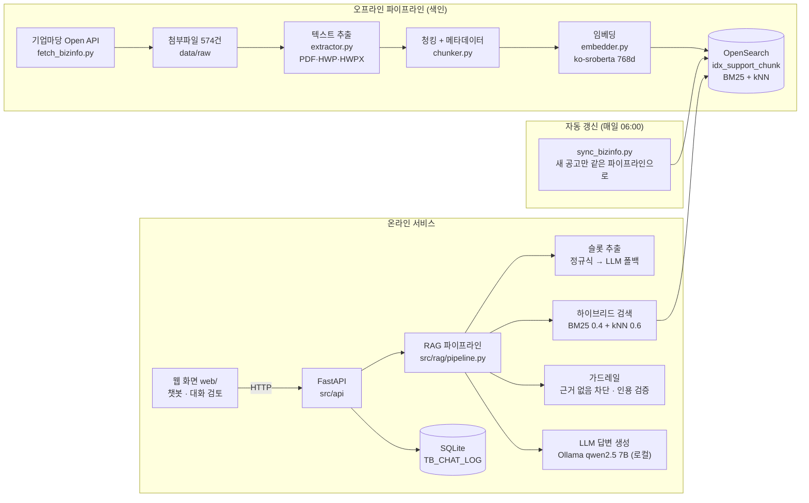

# LocalGovSupportRAG

**지자체·중앙부처 지원사업 공고를 근거로 답하는 RAG 챗봇.**
사용자가 "소상공인인데 온라인 쇼핑몰 입점 지원 있어?"처럼 자기 말로 물으면, 기업마당 공고 650건에서 관련 공고를 찾아
**어느 공고에 근거했는지 `[번호]`로 인용한 답변**과 공고 카드를 돌려줍니다. 근거가 없으면 지어내지 않고 "찾지 못했습니다"라고 답합니다.

- 1차 서비스 범위: 서울특별시(기업마당 해시태그 기준), **기업 대상 지원사업**(중소기업·소상공인·창업) / 개발 기간 2026-08-19 ~ 2026-09-29
- 평가 결과: **Hit@5 85.2% · MRR 0.646** (공고 제목과 다른 표현으로 물은 질의, 자동 갱신 후 650건 기준, 목표 80% · 0.6),
  **출처 인용률 100% · 근거에 없는 수치 0%** (로컬 LLM qwen2.5 7B, 목표 95% · 5% 이하) → [평가 리포트](docs/evaluation_report.md)
- 유료 API 없이 **내 PC에서 전부 동작**합니다 (임베딩 ko-sroberta, LLM Ollama). 공고는 **매일 자동 갱신**됩니다.
- RAG를 처음 접한다면 [학습 노트](docs/study_notes.html)부터 보세요 (기초 개념 → 이 프로젝트 → 트러블슈팅, 도식 포함).

---

## 1. 아키텍처


```mermaid
flowchart LR
    subgraph offline["오프라인 파이프라인 (색인)"]
        A["기업마당 Open API<br/>fetch_bizinfo.py"] --> B["첨부파일 574건<br/>data/raw"]
        B --> C["텍스트 추출<br/>extractor.py<br/>PDF·HWP·HWPX"]
        C --> D["청킹 + 메타데이터<br/>chunker.py"]
        D --> E["임베딩<br/>embedder.py<br/>ko-sroberta 768d"]
        E --> F[("OpenSearch<br/>idx_support_chunk<br/>BM25 + kNN")]
    end
    subgraph sync["자동 갱신 (매일 06:00)"]
        SY["sync_bizinfo.py<br/>새 공고만 같은 파이프라인으로"] --> F
    end
    subgraph online["온라인 서비스"]
        U["웹 화면 web/<br/>챗봇 · 대화 검토"] -- HTTP --> API["FastAPI<br/>src/api"]
        API --> P["RAG 파이프라인<br/>src/rag/pipeline.py"]
        P --> S["슬롯 추출<br/>정규식 → LLM 폴백"]
        P --> H["하이브리드 검색<br/>BM25 0.4 + kNN 0.6"]
        H --> F
        P --> G["가드레일<br/>근거 없음 차단 · 인용 검증"]
        P --> L["LLM 답변 생성<br/>Ollama qwen2.5 7B (로컬)"]
        API --> DB[("SQLite<br/>TB_CHAT_LOG")]
    end
```

**질문 1개가 처리되는 순서** (`src/rag/pipeline.py`의 `answer_question()`)

1. **슬롯 추출**: 질문에서 지역·분야(필터로 사용)와 지원대상(검색어 힌트로 사용)을 뽑습니다. 정규식으로 찾고, 클라우드 LLM(Upstage/OpenAI)을 쓸 때만 못 찾은 경우 LLM에 맡깁니다(로컬 7B는 분야를 틀리게 뽑아서 끔).
2. **하이브리드 검색**: BM25와 kNN을 따로 20개씩 검색합니다. 두 점수는 스케일이 달라서 min-max 정규화를 한 뒤 0.4 : 0.6으로 더하고, 사업당 최대 2청크로 top-5를 고릅니다.
3. **가드레일(호출 전)**: top-5의 최고 kNN 점수가 0.75 미만이면 LLM을 부르지 않고 "찾지 못했습니다"라고 답합니다.
4. **컨텍스트 조립 → LLM 답변**: 근거마다 `[1]~[5]` 번호를 붙이고, 모든 사실 문장에 번호를 인용하도록 강제하는 프롬프트로 답을 생성합니다.
5. **가드레일(호출 후)**: 없는 번호를 인용하면 그 번호를 지우고, 인용이 하나도 없으면 답변을 버립니다.

응답의 `status`는 `ok`, `no_evidence`, `ungrounded`, `llm_unavailable`, `llm_error` 중 하나라서 화면과 평가가 결과를 구분할 수 있습니다.

### 설계에서 내린 주요 결정

| 결정 | 이유 |
|---|---|
| 관계형 DB 없이 OpenSearch 인덱스 하나로 운영 | 청크마다 사업 메타데이터를 같이 저장(비정규화)해서 검색·필터·표시를 한 번에 처리. 대화 로그만 SQLite |
| 임베딩은 로컬 ko-sroberta, LLM은 로컬 Ollama(qwen2.5 7B) | 무과금 운영 방침(분석모델 정의서 2.4). 정의서는 Upstage Solar Pro를 골랐지만 키를 발급하지 않았고, OpenAI 키는 잔액이 없어(429) 로컬 LLM으로 변경. 인터넷 없이 시연 가능. Upstage/OpenAI는 `.env` 키만 넣으면 자동 전환 |
| 하이브리드 가중치 0.4 : 0.6 | 정의서 권장값. 평가에서 0.2~0.8 중 MRR 최고(0.927) |
| 정규식 우선, LLM은 폴백으로만 슬롯 추출 | 대부분의 질문은 "창업", "수출"처럼 후보값을 그대로 포함하므로 LLM 비용·지연을 아낌 |
| 인용 번호 `[n]`을 강제하고 코드로 검증 | 프롬프트 지시만으로는 모델이 규칙을 어길 수 있어서, 정규식으로 인용을 대조 |
| 파일 확장자가 아니라 파일 앞부분 바이트로 형식 판별 | `.pdf`/`.hwpx`로 저장됐지만 실제로는 HWP인 파일이 실데이터에 섞여 있었음 |

---

## 2. 기술 스택

| 영역 | 사용 기술 |
|---|---|
| 언어 | Python 3.12 |
| 데이터 수집 | 기업마당(bizinfo.go.kr) Open API (RSS/XML) |
| 전처리 | pdfplumber, olefile(HWP), zipfile+XML(HWPX) |
| 검색 | OpenSearch 3.8 (faiss HNSW, cosine), opensearch-py |
| 임베딩 | `jhgan/ko-sroberta-multitask` (sentence-transformers, 768차원, 로컬) |
| LLM | Ollama `qwen2.5-rag:7b` (qwen2.5:7b + 읽기 한도 16k, [`ollama/Modelfile`](ollama/Modelfile)), OpenAI 호환 API, temperature 0.2. 대안: Upstage Solar Pro / OpenAI (키만 넣으면 자동 선택) |
| 백엔드 | FastAPI, Pydantic, uvicorn, SQLite |
| 화면 | HTML·CSS·JS(빌드 도구·외부 CDN 없음, FastAPI가 서빙) · Streamlit(관리용, 선택) |
| 자동 갱신 | Windows 작업 스케줄러(리눅스는 crontab) + 증분 동기화 스크립트 |
| 테스트 | FastAPI TestClient, Streamlit AppTest, Node(화면 로직), headless Edge (실행 스크립트 방식, pytest 미사용) |

버전은 [`requirements.txt`](requirements.txt)에 고정했습니다.

---

## 3. 폴더 구조

```
LocalGovSupportRAG/
├── src/
│   ├── crawler/fetch_bizinfo.py      # [WBS 2] 기업마당 API 수집 -> data/raw + metadata.csv
│   ├── preprocessing/
│   │   ├── extractor.py              # [WBS 3] PDF/HWP/HWPX 텍스트·표 추출 -> extracted.json
│   │   └── chunker.py                # [WBS 3] 문장 경계 청킹(오버랩) + 접수기간/금액 추출 -> chunks.json
│   ├── indexing/                     # [WBS 4]
│   │   ├── config.py                 #   인덱스 이름·임베딩 모델·접속 설정 (공통)
│   │   ├── index_mapping.py          #   매핑(keyword/date/knn_vector) 정의 및 인덱스 생성
│   │   ├── embedder.py               #   청크 임베딩 -> chunks_embedded.json (이어하기 지원)
│   │   ├── bulk_indexer.py           #   Bulk API 색인 (_id = chunk_id, 재실행해도 중복 없음)
│   │   └── verify_index.py           #   색인 검증 (문서 수, 매핑, BM25/kNN 동작)
│   ├── rag/                          # [WBS 5] query_slots, hybrid_search, context_builder,
│   │                                 #   prompt_template, generator, guardrail, llm_client, pipeline
│   ├── api/                          # [WBS 6] FastAPI: main, schemas, dependencies, chat_log(대화 기록·검토),
│   │   └── routers/                  #   program_service / routers(chat, programs, sync_status, review)
│   ├── evaluation/                   # [WBS 7] metrics, retrieval_eval, answer_eval
│   └── sync/sync_bizinfo.py          # [WBS 10 준비] 새 공고 자동 갱신 (증분 동기화)
├── web/                              # [WBS 9] 챗봇 화면(index.html) + 대화 기록 검토(review.html)
├── ui/                               # [WBS 6] Streamlit: app.py, api_client.py (관리용)
├── scripts/                          # start/stop_chatbot, run_sync, register_sync_task (.bat 더블클릭 실행)
├── ollama/Modelfile                  # [WBS 9] 로컬 LLM 설정 (읽기 한도 16k)
├── tests/                            # run_all.py + 테스트 12종
├── data/
│   ├── raw/, processed/              # 수집·가공 산출물 (git 제외)
│   └── eval/eval_queries.json        # [WBS 7] 평가 질의셋 + 정답 라벨
└── docs/
    ├── study_notes.html              # 초급자용 학습 노트 (RAG 기초 → 이 프로젝트 → 트러블슈팅)
    ├── evaluation_report.md          # [WBS 7] 평가 리포트
    ├── demo_scenario.md              # 시연 순서
    └── eval/                         # 평가 결과 원자료(JSON)
```

---

## 4. 실행 방법 (Windows 기준)

### 4.1 준비
1. **Python 가상환경**
   ```
   python -m venv .venv
   .venv\Scripts\python.exe -m pip install -r requirements.txt
   ```
2. **OpenSearch 3.8** - zip으로 설치하고 `config/opensearch.yml`에 `plugins.security.disabled: true`를 넣은 뒤
   `bin\opensearch.bat`로 실행합니다. 로컬 개발용이라 HTTP·무인증이고, `localhost:9200`에서 준비되기까지 약 30초 걸립니다.
3. **로컬 LLM (Ollama)** - [ollama.com](https://ollama.com)에서 설치한 뒤 모델을 받습니다(약 4.7GB). `.env` 설정은 필요 없습니다.
   ```
   ollama pull qwen2.5:7b
   ```
   챗봇에 쓰는 `qwen2.5-rag:7b`(읽기 한도를 늘린 버전)는 `scripts\start_chatbot.bat`이 처음 실행될 때 자동으로 만듭니다.
   LLM이 없어도 챗봇은 동작하고, 답변 문장 대신 관련 공고 목록만 안내합니다.
4. **`.env`** (프로젝트 루트, git 제외)

   | 변수 | 용도 | 필수 |
   |---|---|---|
   | `BIZINFO_API_KEY` | 기업마당 Open API 인증키 (수집 단계) | 수집 시 |
   | `UPSTAGE_API_KEY` / `OPENAI_API_KEY` | 클라우드 LLM을 쓸 때 ([console.upstage.ai](https://console.upstage.ai/api-keys)) | 선택 |
   | `LLM_PROVIDER` / `LLM_MODEL` | 생략하면 자동 선택: Upstage 키 → Ollama 모델 → OpenAI 키 순. `upstage`/`ollama`/`openai`/`none`으로 고정 가능 / 모델명 덮어쓰기 | 선택 |
   | `OPENSEARCH_HOST` / `OPENSEARCH_PORT` | 기본 `localhost` / `9200` | 선택 |
   | `CHAT_LOG_DB_PATH` | 대화 이력 DB 경로 (기본 `data/chat_log.db`) | 선택 |

### 4.2 색인 파이프라인 (처음 한 번, 순서대로)
```
.venv\Scripts\python.exe src\crawler\fetch_bizinfo.py      # 수집 (API 키 필요)
.venv\Scripts\python.exe src\preprocessing\extractor.py    # 추출 (약 10분 이상 - 느려도 멈춘 게 아님)
.venv\Scripts\python.exe src\preprocessing\chunker.py      # 청킹
.venv\Scripts\python.exe src\indexing\index_mapping.py     # 인덱스 생성 (이미 있으면 건너뜀)
.venv\Scripts\python.exe src\indexing\embedder.py          # 임베딩 (첫 실행 시 모델 다운로드)
.venv\Scripts\python.exe src\indexing\bulk_indexer.py      # 색인
.venv\Scripts\python.exe src\indexing\verify_index.py      # 검증
```

### 4.3 서비스 실행
**한 번에 실행:** `scripts\start_chatbot.bat`(더블클릭 가능)이 OpenSearch → 로컬 LLM 준비 → 백엔드를 띄우고 브라우저에서 챗봇(http://127.0.0.1:8000)을 엽니다.
이미 떠 있는 서비스는 건너뛰고, 로그는 `logs\`에 남습니다. 종료는 `scripts\stop_chatbot.bat`. Streamlit 관리 화면도 쓰려면 `scripts\start_chatbot.ps1 -Streamlit`.

| 화면 | 주소 | 하는 일 |
|---|---|---|
| 챗봇 | http://127.0.0.1:8000 | 질문 → 인용 답변 + 근거 카드(마감·D-day 표시), 인용 번호를 누르면 카드로 이동, 헤더에 최근 자동 갱신 시각 |
| 대화 기록 검토 | http://127.0.0.1:8000/review.html | 실제로 들어온 질문·답변을 상태별로 보고 **좋음/나쁨 + 메모**로 판정 (원본 기록은 그대로, 판정은 별도 테이블) |
| API 문서 | http://127.0.0.1:8000/docs | Swagger UI |

> 검토 화면은 질문 원문을 그대로 보여주지만 로그인이 없습니다. 서버가 `127.0.0.1`에만 열려 있어 이 PC 밖에서는 접근할 수 없고, 외부에 공개할 때는 인증을 먼저 붙여야 합니다.
OpenSearch 설치 경로가 다르면 환경변수 `OPENSEARCH_HOME`을 설정하세요.
로컬 LLM은 한동안(5분) 질문이 없으면 GPU에서 내려가서, 그다음 첫 질문은 20~30초 걸립니다(이후 5~10초). 따라 해볼 질문은 [데모 시나리오](docs/demo_scenario.md)에 있습니다.

**직접 실행:**
```
.venv\Scripts\python.exe -m uvicorn src.api.main:app --port 8000    # 백엔드 (준비까지 약 20초)
.venv\Scripts\python.exe -m streamlit run ui/app.py                 # (선택) Streamlit 관리 화면 -> :8501
```
- API 문서: http://127.0.0.1:8000/docs (Swagger UI)
- API 주소는 `localhost` 말고 **`127.0.0.1`**로 부르세요. Windows에서 `localhost`는 IPv6를 먼저 시도해서 요청마다 약 2초가 더 걸립니다(실측 14~30ms vs 약 2,060ms).

| 엔드포인트 | 설명 |
|---|---|
| `POST /chat` | 질문 → 인용 답변 + 근거 카드 + 적용된 검색 조건 + 응답 시간 |
| `GET /chat/history/{session_id}` | 대화 이력 재조회 |
| `GET /programs` | 지원사업 목록 (지역/분야 필터, 사업명 부분 검색, 페이지) |
| `GET /programs/{program_id}` | 지원사업 상세 (본문 청크 순서대로) |
| `GET /programs/filters` | 화면 필터 선택지 |
| `GET /sync/status` | 자동 갱신의 최근 실행 기록 |
| `GET /review/summary`, `GET /review/chats` | 대화 기록 요약·목록 (상태·판정 필터, 검색, 페이지) |
| `PUT` / `DELETE /review/chats/{chat_id}` | 대화 판정 저장(좋음/나쁨 + 메모) / 취소 |
| `GET /health` | OpenSearch·인덱스·LLM 상태 |

### 4.4 공고 자동 갱신 (매일)
8월에 한 번 받은 574건은 한 달 뒤 API에서 대부분 새 공고로 바뀌어 있었습니다(9/29 기준 서울 517건 중 175건이 새 공고).
`src/sync/sync_bizinfo.py`가 API 목록에서 **아직 없는 공고만** 골라 위 4.2의 함수들로 다운로드 → 추출 → 청킹 → 임베딩 → 색인합니다.
```
.venv\Scripts\python.exe src\sync\sync_bizinfo.py --dry-run   # 새 공고 목록만 확인 (아무것도 안 바꿈)
.venv\Scripts\python.exe src\sync\sync_bizinfo.py             # 반영
scripts\register_sync_task.bat                                # 매일 06:00 Windows 작업 스케줄러에 등록 (-Unregister로 해제)
# 리눅스 crontab: 0 6 * * * cd /app && .venv/bin/python src/sync/sync_bizinfo.py >> logs/sync.log 2>&1
```
- 색인이 성공한 뒤에만 산출물 4개(`metadata.csv`, `extracted.json`, `chunks.json`, `chunks_embedded.json`)를 원자적으로 덧붙이고, "처리함" 기록인 `metadata.csv`는 맨 마지막에 씁니다. 중간에 죽으면 다음 실행이 같은 공고를 다시 처리하고, 색인은 `_id = chunk_id`라 중복이 생기지 않습니다.
- 잠금 파일로 동시 실행을 막고, 실행 기록은 `data/sync_state.json` / `logs/sync.log` / `GET /sync/status`에 남습니다.
- 마감된 공고는 지우지 않습니다(8월 공고로 만든 평가셋을 재현하기 위해). 대신 화면 카드에 "마감"을 표시합니다.
- 첫 실행(2026-09-29): 새 공고 175건 → 청크 +1,023개(3,884 → 4,907), 5분 45초, 다운로드 실패 0건. 바로 다시 실행하면 새 공고 0건(5초).

---

## 5. 테스트

OpenSearch를 켜둔 상태에서 명령 하나로 전체를 돌립니다. UI 연동 테스트에 필요한 백엔드는 스크립트가 직접 띄웠다가 끕니다.
이 백엔드는 **LLM을 끄고(`LLM_PROVIDER=none`)** 띄웁니다. 실제 LLM은 같은 질문에도 답하거나 거절할 수 있어서 테스트 결과가 실행마다 달라지기 때문입니다.
테스트는 코드 회귀를, 실제 LLM 답변 품질은 `src/evaluation/answer_eval.py`(평가)를 맡습니다.
개수 기대값은 고정 숫자가 아니라 현재 산출물 파일에서 계산합니다 - 자동 갱신으로 데이터가 매일 바뀌기 때문입니다.
```
.venv\Scripts\python.exe tests\run_all.py           # 전체 (약 4분)
.venv\Scripts\python.exe tests\run_all.py --quick   # 느린 2개 제외
```

| 테스트 | 항목 | 확인하는 것 |
|---|---|---|
| `test_evaluation_metrics.py` | 29 | Hit@k·MRR·인용·수치·자리표시자 베낌 검사 계산 (손으로 계산한 기대값과 비교) |
| `test_data_pipeline.py` | 18 | 수집 → 추출 → 청킹 → 임베딩 → 색인 산출물이 서로 맞물리는지 |
| `test_api.py` | 44 | 전체 엔드포인트, 입력 검증, 가짜 LLM으로 ok/ungrounded/llm_error 경로 |
| `test_error_handling.py` | 26 | 검색 중 끊김·인덱스 없음·쿼리 오류·LLM 타임아웃·DB 오류 대응, 화면 에러 메시지 |
| `test_search_determinism.py` | 1 | 같은 질문이면 실행마다 같은 top-5 (평가 중 발견한 버그의 재현 테스트) |
| `test_retrieval_quality.py` | 4 | 검색 성능이 목표(Hit@5 80%, MRR 0.6) 아래로 떨어지지 않는지 (성능 회귀) |
| `test_answer_eval.py` | 9 | 답변 품질 평가 코드 경로 (가짜 LLM) |
| `test_llm_provider.py` | 16 | LLM 자동 선택, 모델이 바꿔 쓴 거절 문장 인식, Ollama 슬롯 추출 차단 (로컬 LLM 연결 중 겪은 문제의 재현 테스트) |
| `test_ui_backend_integration.py` | 36 | 실제 백엔드에 붙인 Streamlit 화면 시나리오 |
| `test_web_ui.py` | 15 | 웹 화면 로직(Node: XSS 방어·답변 형식·마감 계산), 서빙이 API를 가로채지 않는지, headless Edge로 실제 렌더링 |
| `test_sync.py` | 15 | 자동 갱신: 새 공고 판별, 산출물 4개 정합성, 잠금, CSV 줄바꿈 깨짐(Windows) 재현 |
| `test_review.py` | 17 | 대화 검토 API: 필터·검색·페이지, 판정 저장/덮어쓰기/취소, SQL 인젝션, 원본 기록 불변 |

마지막 실행(2026-09-29): **12개 테스트, 230/230 통과.**

---

## 6. 평가 결과 요약

자세한 내용은 [docs/evaluation_report.md](docs/evaluation_report.md)에 있습니다. 질의 27개에 대해 정답 공고를 직접 라벨링해서 측정했습니다.

| 지표 | 목표 | 원 질의 | 표현을 바꾼 질의* |
|---|---|---|---|
| Hit@5 (공고 491건, 8월) | 80% | 100.0% | 88.9% |
| Hit@5 (자동 갱신 후 650건) | 80% | 100.0% | **85.2%** |
| MRR (491건 → 650건) | 0.6 | 0.927 → 0.914 | 0.713 → **0.646** |
| 출처 인용률 | 95% | **100%** | |
| Hallucination (근거에 없는 수치 포함) | 5% 이하 | **0.0%** | |
| 형식 틀을 베낀 답변 ("OO 지원사업") | - | **0%** (프롬프트 수정 전 1/26) | |
| 무관 질문 최종 거절 | - | **100%** (6/6) | |
| 응답 시간 | 5초 | 검색 49ms / LLM 포함 평균 6.5초, p95 10.8초 (목표 초과) | |

공고가 늘자 검색 점수가 조금 내려간 것은 경쟁 후보가 많아진 영향과 함께, 평가 정답 라벨이 8월 공고로만 만들어져 새 공고가 실제로 더 좋은 답이어도 오답으로 세는 영향이 섞여 있습니다. 데이터가 계속 바뀌는 서비스는 평가셋도 주기적으로 갱신해야 합니다.

\* 원 질의는 공고 제목을 본 뒤 작성해서 제목 단어와 겹치는 편향이 있습니다. 그래서 같은 의도를 제목 단어를 피해 다시 쓴 질의로도 측정했고, 서비스 성능 추정치로는 이쪽을 봅니다.

- 표현을 바꾸면 **BM25 단독은 Hit@5 37%로 무너지고**, 성능은 kNN(의미 검색)이 끌고 갑니다.
- 가드레일 임계값을 **0.77 → 0.75**로 낮췄습니다. 0.77은 표현을 바꾼 정상 질문의 18.5%를 막았고, 0.75에서 통과하는 무관 질문 2건은 LLM이 모두 거절했습니다.
- 로컬 7B 모델을 붙이면서 인용률이 처음에는 **48%**였습니다. 모델이 출처를 `[번호]` 대신 사업명으로 밝혔기 때문이고, 프롬프트에 **답변 형식 예시**를 넣어 96.3%, 거절 규칙을 다듬어 100%가 됐습니다(평가 리포트 5·7장).
- 표현을 바꾼 질문에서는 정답 공고가 근거에 있는데도 모델이 거절하는 경우가 남아 있습니다(24건 중 3건).

---

## 7. 한계점

| 한계 | 영향 | 개선 방향 |
|---|---|---|
| **로컬 7B LLM의 한계** | 응답 평균 6.43초(목표 5초), 첫 질문은 모델 로딩으로 20~30초. 슬롯 추출용 도구 호출을 지키지 못해 LLM 슬롯 추출은 끔. 근거가 흐릿하면(표가 뒤섞인 PDF 텍스트) 보수적으로 거절 | 더 큰 모델(qwen2.5:14b) 또는 Upstage 키로 비교 평가. hallucination 지표는 수치만 검사하는 대리 지표라 사람 검토 병행 |
| **임베딩 입력 한도 초과**: ko-sroberta는 128토큰까지만 읽는데 청크의 99.0%가 이를 넘음 | 청크 벡터에 앞부분 약 250자(중앙값 18.7%)만 반영됨. 통합 공고 뒷부분의 세부 사업은 kNN으로 못 찾고 BM25에만 의존 | 임베딩용 청크를 짧게 나누기 / 긴 입력을 받는 모델(예: bge-m3) / 청크 안을 여러 창으로 나눠 임베딩 - 모두 재임베딩·재평가 필요 |
| **토큰 수가 근사치**: `.venv`에 tiktoken이 설치돼 있지 않았음 | 청크 크기 "500~800토큰"이 실제로는 글자수/1.7 기준(약 850~1,360자) | tiktoken 설치 후 재청킹 - 위 임베딩 문제와 함께 결정 |
| **OCR 미지원** | 8월 첨부 574건 중 이미지(PNG/JPG) 38건, 텍스트가 빈 문서(스캔본 추정) 42건 등이 제외(자동 갱신분도 스캔본 15건 제외) | Tesseract 등 OCR 도입 |
| **기업 대상 공고만 있음** | 데이터 출처(기업마당)가 사업자 대상이라 "청년 월세", "법인세" 같은 개인·세무 질문은 근거 없음으로 끝남 (실제 대화 기록에서 확인) | 화면 인사말에 범위 명시(완료), 보조금24 등 개인 대상 출처 추가 |
| **통합 공고의 지역** | 전국 사업 수백 개를 모은 공고가 지역="서울"이라, 지역을 안 밝힌 질문에 타지역 사업이 섞일 수 있음 (사용자 제보). 프롬프트 규칙으로 8건 → 1건 | 통합 공고를 사업 단위로 분리 색인 |
| **한국어 형태소 분석기(nori) 미설치** | BM25가 "벤처나라에"와 "벤처나라"를 다른 단어로 봄. 사업명 검색은 부분 문자열 검색(wildcard)으로 우회 | `analysis-nori` 설치 후 재색인 |
| **`region_name`은 수집 해시태그**(전부 "서울") | 전국 단위 통합 공고도 "서울"로 분류됨. 지역 필터의 변별력 없음 | 본문에서 실제 지역 추출 / WBS 10 지역 확장 |
| **가드레일이 점수 하나로 판단** | "개인 주택담보대출"처럼 기업 융자와 의미가 가까운 질문은 통과(0.826) - 현재는 LLM이 거절해서 최종 결과는 맞음 | 질의 의도 분류 추가 |
| **평가셋이 작고 라벨이 검토 전** | 질의 27개(질의 1개 = Hit@5 3.7%p), 라벨은 초안 | 사용자 검토, 공고를 보지 않고 쓴 질의 추가 |
| **모듈 import 방식**: `src/` 하위 파일이 같은 폴더 기준 import + `sys.path` 설정을 반복 | 파일마다 경로 설정 코드가 중복됨 (각 스크립트를 단독 실행하며 개발했기 때문) | `src`를 패키지로 전환하고 `python -m` 실행으로 통일 - 모든 실행 명령이 바뀌어서 이번 범위에서는 보류 |
| 로컬 단일 노드·무인증 OpenSearch | 운영 배포 불가 | 정의서의 docker-compose 배포 계획, 보안 플러그인 활성화 |

---

## 8. 개발 과정에서 찾아 고친 문제 (일부)

| 증상 | 원인 | 조치 |
|---|---|---|
| 같은 질문에 실행마다 다른 top-5 | 점수가 같은 중복 공고의 순서가 실행마다 바뀌는 해시값에 따라 정해짐 | `(-score, chunk_id)` 정렬 + 재현 테스트 (수정 전 66개 조합 중 9개 불일치 → 0개) |
| 통합 공고 하나가 top-5를 독차지 | 수백 개 사업이 담긴 PDF가 청크를 수십 개 만듦 | 사업당 최대 2청크 상한 |
| OpenSearch 장애가 "관련 공고 없음"으로 안내됨 | 검색 함수가 연결 실패를 빈 결과로 삼킴 | 예외를 올리고 API에서 503으로 변환 |
| 추출기가 `.hwpx` 파일에서 실패 | 확장자는 `.hwpx`인데 실제로는 옛 HWP(OLE) 형식 | 파일 앞부분 바이트로 형식 판별 |
| LLM 없음(`None`)을 명시해도 키가 있으면 LLM 호출 | `None`을 "인자 생략"과 같게 처리 | 두 의미를 분리하고, 가짜 키로 재현하는 테스트 추가 |
| `.env`에 OpenAI 키를 넣었는데 "LLM 비활성" | 기본값 upstage의 키 칸만 확인 | 키가 있는 쪽을 자동 선택 |
| 로컬 LLM이 근거가 있는데도 "정보가 없다"며 일반 상식으로 답함 | Ollama가 읽기 한도(4096)를 넘는 프롬프트 5,836토큰 중 2,050토큰만 남기고 **에러 없이 잘라냄** | Modelfile로 한도 16k인 모델 생성 (OpenAI 호환 주소로는 요청마다 넘길 수 없어서) |
| LLM을 붙이자 정상 질문 통과율이 81.5% → 55.6%로 하락 | 7B 모델의 슬롯 추출이 분야를 틀리게 뽑아 필터가 정답을 걸러냄 | 로컬 LLM에서는 슬롯 추출 LLM 폴백을 끔 |
| 출처 인용률 48% | 7B 모델이 `[번호]` 대신 사업명으로 출처를 밝힘 | 프롬프트에 답변 형식 예시 추가 → 96.3% |
| 표현을 바꾼 질문에 정답이 근거에 있어도 거절 | 거절 규칙이 강해서 7B 모델이 보수적으로 판단 | "도움이 될 사업이 하나라도 있으면 안내"를 먼저 두도록 규칙 수정 (평가셋 표현을 예시로 넣었다가 데이터 누수라 제거) |
| 인용률 100%인데 답변 제목이 "OO 지원사업" | 모델이 형식 예시의 자리표시자를 베낌 (웹 화면 캡처로 발견) | `<근거 문서 제목의 사업명>` 틀로 변경 + 베낌 비율 지표 추가 (1/26 → 0) |
| "창업 지원"에 안산·울산 사업이 나옴 | 전국 통합 공고의 지역 값이 수집 해시태그("서울") | 프롬프트에 서비스 범위 명시 (타지역 언급 8 → 1) |
| 자동 갱신 후 테스트 5개 실패 | 테스트에 8월 기준 건수(사업 491 등)를 고정해 둠 | 기대값을 산출물 파일에서 계산 |
| 자동 갱신의 CSV 줄 끝이 `\r\r\n` | Windows에서 텍스트 쓰기가 줄바꿈을 한 번 더 변환 | `newline=""` + 옛 방식이면 실패하는 테스트 |

---

## 9. 문서

- [학습 노트](docs/study_notes.html) - RAG 기초(LLM·임베딩·청크·검색)부터 이 프로젝트의 구현과 트러블슈팅까지, 도식과 용어 사전 포함 (브라우저로 열기)
- [평가 리포트](docs/evaluation_report.md) - 평가 설계, 방식 비교, 가드레일 분석, 한계
- [데모 시나리오](docs/demo_scenario.md) - 시연 순서와 실측 결과 (성공 사례 + 한계 사례)
- 기획서·요구사항 정의서·테이블정의서·화면정의서·분석모델 정의서·WBS는 레포 밖(로컬 산출물 폴더)에 있습니다.
  - 테이블정의서와 달라진 점: `TB_CHAT_LOG`에 `STATUS` 컬럼 추가 (평가에서 정상 답변/근거 없음을 구분하기 위함), 판정용 `TB_CHAT_REVIEW` 테이블 추가 (CHAT_ID, VERDICT good/bad, NOTE, REVIEWED_AT) - 문서 갱신 필요
